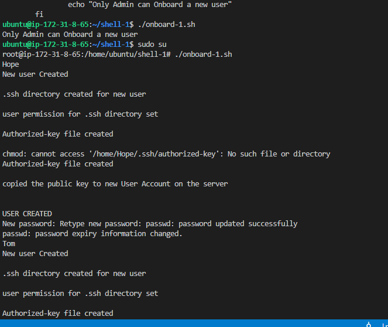
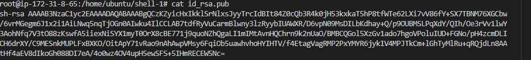

## Documentation for Aux Project 1
## SHELL SCRIPTING - aws virtual server

## STEP 1 — Onboard New Users to a remote Server

-- Create our shell script that reads a csv file.
-- Then by ssh into my remote server labelled 'Aux-Project 1' from my vscode terminal in windows machine 

`vi onboard.sh`--(Copied and paste my onboard script on how to execute  into onboard-1.sh file)
  

`mkdir shell-1 && cd shell-1 && touch id_rsa id_rsa.pub names.csv`--(running command to create shell-1 directory in ubuntu home. In shell-1 directory created id_rsa id_rsa.pub names.csv files)

`vi id_rsa`--(Using the vi text editor in the shell-1 directory in ubuntu home to Populate id_rsa file with the private key pair)

`vi id_rsa.pub`--(Using the vi text editor in the shell-1 directory in ubuntu home to Populate id_rsa file with the public key)

`vi names.csv`--(Using the vi text editor in the shell-1 directory in ubuntu home to Populate names.csv file with new user first names)

`sudo groupadd developers`--(In Shell-1 directory in ubuntu home create a developers group)

`sudo chmod tx onboard.sh`--(In Shell-1 directory in ubuntu home create a developers group)

`mv onboard-1.sh /home/ubuntu/shell-1/`--(Moving Onboard-1.sh script file to In Shell-1 directory in ubuntu home, we ran "ls -l" to view more properties for onboard for example the Readwrite permission)

`sudo chmod +x onboard-1.sh `--(Ran command to ensure onboard-1.sh file is executeable)

`./onboard-1.sh `--(Ran command to test onboard-1.sh file without sudo privileges)

`sudo su`; `./onboard-1.sh`--(Ran command as a superuser privileges before testing onboard-1.sh file)

`ls -l /home`--(confirming list of users created in remote server)

`getent group developers`--(confirming developers group created in remote server, displaying group id in output)

`cat /etc/passwd`--(Confirming password in etc directory in shell-1 in ubuntu home. we can see users created with group id attached)

`cat /etc/passwd`--(Confirming password in etc directory in shell-1 in ubuntu home. we can see users created with group id attached)

`cat /etc/passwd | awk -F':' '{ Print $1}' | xargs -n1 groups`--(AWK command is used for filtering and analysing text. Tt shows text in  a more readable format)

## Task - Test users randomly to ensure connectivity to server using private key.

`cat id_rsa.pub`--(In terminal-1 run command to spit out public key saved in id_rsa.pub configured to server dovument out of  '/home/ubuntu/shell-1' directory in onboard-1.sh)

`vi aux-project.pem`--(open a new terminal-2 and Create a aux-project.pem key file . Copy and paste private ssh key to connect to remote server as a developer listed in develpers' group)

`ls /home/`--(In terminal-1 displays users in develpers group that can connect to remote server)

`ssh -i aux-project.pem Bonny@18.207.110.26`--(In terminal-2 test random user to connect to remote server. using private key pair (aux-project-pem) and remote server public IP address - copy from asw console. Output:WARNING: UNPROTECTED PRIVATE KEY FILE!)

`sudo chmod 600 aux-project.pem`--(In terminal-2 set protection for our private key "aux-project.pem")

`ssh -i aux-project.pem Bonny@18.207.110.26`--(In terminal-2 second attention to connectto remote server as a user whilst we set protection for our private key "aux-project.pem" )

`sudo apt update`--(In terminal-2 second connection established to remote server)

